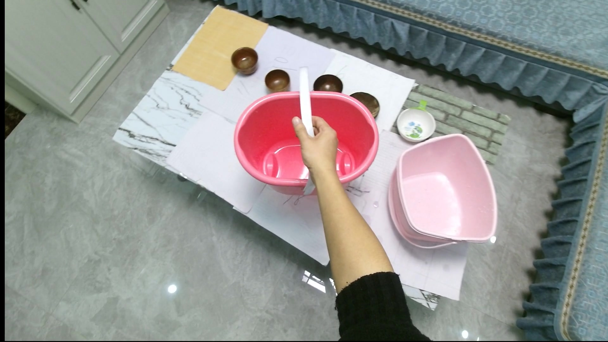

# Training Data Preparation

The script under this repository is for HOI4D, a dataset with many provided annotations, which making the preparation easier. Other datasets could also be used for training. The only requirement is to extract the hand skeleton projection image, segmentation and mask out as the condition input.

1. Download the HOI4D dataset and code from this [website](https://hoi4d.github.io). Follow the instruction in the repo to decode RGB and depth images from video clips (actually only RGB images are required in our training). The directory:

    ```bash
    ROOT_DIR
        - HOI4D-Instructions
        - HOI4D_annotations
        - HOI4D_release
        - handpose
        - camera_params
        ...
    ```

2. Install manopth inside the HOI4D-Instructions according to [this](https://github.com/leolyliu/HOI4D-Instructions?tab=readme-ov-file#human-hand-pose)

3. Put the `prepare_data.py` into HOI4D-Instructions and run:
    ```bash
    python prepare_data.py --root_dir=<ROOT_DIR>
    ```

4. The data pair should look like this: 
    RGB| Skeleton | Mask
    ---|---|---
    ||
