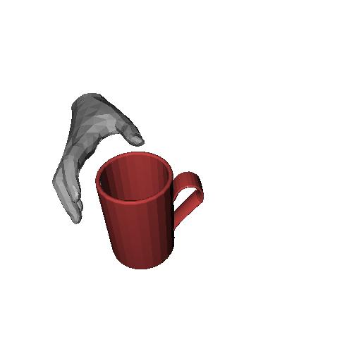
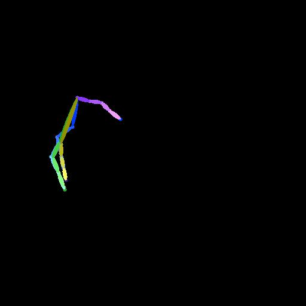
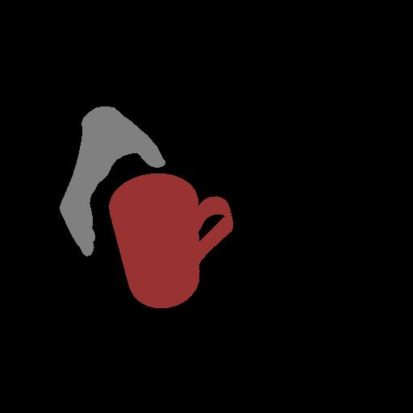

# Test Data Generation

We leverage GrabNet to generate contacted hand-object synthetic images and then use spherical interpolation to obtain fetching trajectory.

1. Follow this [repo](https://github.com/otaheri/GrabNet) to download code, prepare envrionment and pretrained models.
2. Replace the original `grabnet/tools/utils.py` with new `utils.py` in this folder.
3. Put the `get_image.py` into code base root. Please revise the `getObjCat` function to adapt to your dataset. This function is to provide a coarse template prompt with given object category. Revise `getObjPath` to obtain all your object model list.
4. If no display device is connected to your server and the code is run on Linux, some warnings may pop out. These could help:

    ```bash
    exportLD_PRELOAD=/usr/lib/x86_64-linux-gnu/libGLEW.so 
    xvfb-run -a -s "-screen 0 1400x900x24" bash
    ```
5. Then run the scripts:
    ```bash
    python get_image.py --obj-path <obj_path> \
           --rhm-path mano_models/MANO_RIGHT.pkl \
           --outdir <output_dir> --n_samples 50 --bs 3
    ```

6. The data pair should look like this: 
    RGB| Skeleton | Mask
    ---|---|---
    ||